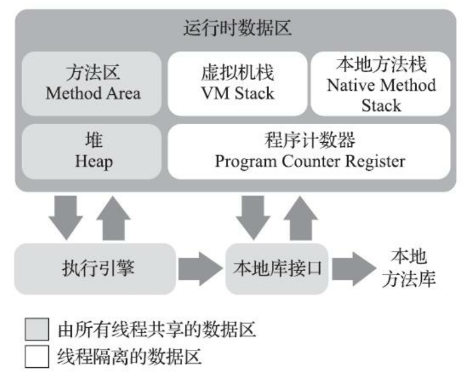

# 2章 自动内存管理

## 运行数据区域

虚拟机将管理的内存划分为多个区域，每个区域有不同的功能和生命周期。周期有的依附于虚拟机，有的依附于线程。

### 程序计数器

计数器记录线程待执行字节码的地址。字节码解释器通过程序计数器获取下一个要执行的字节码。

线程具有独立的计数器，计数器间相互独立互不影响。（这类内存被称为线程私有内存。）

原因：虚拟机线程被多个处理器（内核）交替执行。

内容：

- Java方法：字节码地址。
- Native方法：空（Undefined）。

计数器是唯一在《规范》（《Java虚拟机规范》）中没有被规定任何内存溢出情况的区域。

### Java虚拟机栈

虚拟机栈是线程私有的。

栈帧是方法运行内存。栈帧在方法被调用时被创建、入栈，方法结束时被出栈、销毁。

内容：局部变量表、操作数栈、动态链接、方法出入口信息等。

《规范》对其内存异常规定：

- 访问超过栈最大深度时，JVM抛出栈溢出。
- 扩容时无法申请到空间时，JVM抛出内存溢出。

#### 局部变量表

内容：基本数据类型、引用、returnAddress。

存储空间用变量槽表示（slot），long、double占两个槽，其他类型占一个槽。

表所需空间大小在编译期确定，在栈帧创建和方法执行期间不会改变。（大小指槽数，槽的大小（如32bit、64bit）由具体的虚拟机实现确定。）

### 本地方法栈

本地方法栈作用类似于Java虚拟机栈，作用对象是本地方法。

### Java堆

堆被所有线程共享内存。

堆在虚拟机启动时创建。

内容：对象实例。

堆是被垃圾收集器管理的区域。

《规范》没有对其进行进一步的划分，细分是为了满足特定垃圾收集器的实现。

堆可以被实现为固定或可扩展（主流实现）的。可扩展堆使用-Xmx、-Xms设置大小。

《规范》对其内存异常规定：

- 无可用空间且无法扩展时，JVM抛出内存溢出。

### 方法区

方法区是线程共享内存。

内容：类型信息、常量、静态变量、即时编译器编译后的代码缓存等。

永久代≠方法区

永久代是垃圾收集器中的概念，早期hotSpot将垃圾收集器分区拓展到方法区，将方法区作为永久代实现。现在hotSpot已经废弃永久代的概念，采用本地内存来实现方法区。

《规范》对其内存异常规定：

- 无可用内存时，JVM抛出内存溢出。

#### 运行时常量池

运行时常量池是方法区的一部分。Class文件中有项信息是常量池表，该表用于存储编译期生成的各种字面量与符号引用，这部分数据在类加载后存放到运行时常量池。

### 直接内存
