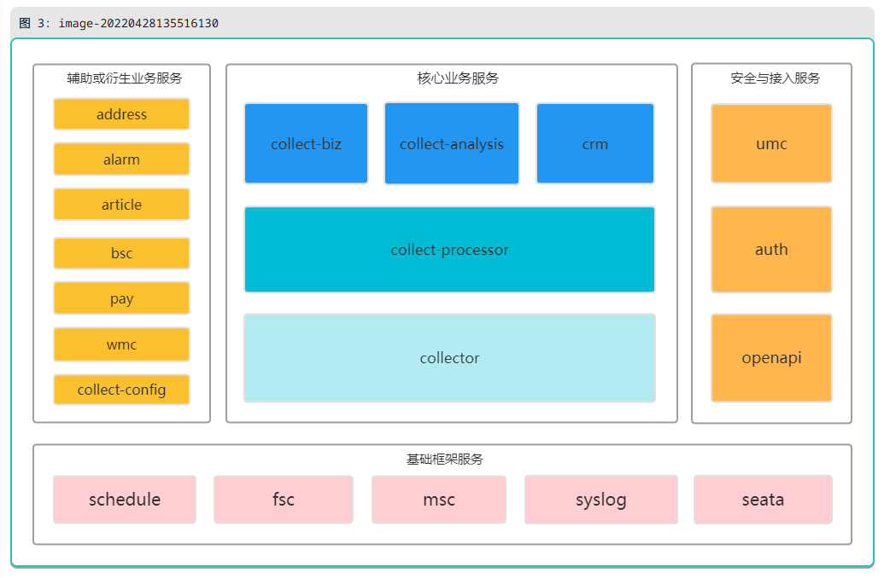

collector

采集处理器、采集处理器实例

实例启动：在配置的服务器上运行一个collector服务，启动时会调用该服务接口启动，netty创建网络通信

架构

1. 基础框架服务

   基础框架服务主要实现平台中与业务无关的基础框架功能，如定时调度服务、文件管理服务、消息推送服务、用户操作日志服务和分布式事务。

2. 辅助或衍生业务服务

   辅助业务用于支撑核心业务服务，包括基础数据服务、地址管理服务、监控告警服务、支付服务、配置管理服务；衍生业务服务是指非核心的且相对独立的业务服务，包括工单服务、文章服务；

3. 安全与接入服务

   安全与接入服务负责系统安全和第三方接入，负责平台双向访问，包括用户权限管理服务、认证与授权服务、开放API服务。

4. 核心业务服务

   核心业务分为三层，从上到下分为应用层、采集数据处理层、采集层。涉及表具指令处理的api调用，应避免跨层交互，因为在指令传达层面，类似于TCP/IP协议簇，是自下而上逐层封装的，每层只关注本层能理解的和应该关注的，下层为上一层提供服务支撑。采用三层封装的另一个原因是，因为应用层是面向人的，是人机交互的Web系统，而采集层是面向设备的，是服务器与设备交互的物联网系统，在燃气业务场景中，二者的系统并发度完全不在一个数量级上，也就是从微服务部署和服务器资源利用的角度来说，采集层的部署实例数是要明显大于应用层部署实例数，只有将应用层功能与采集层功能解耦，才能实现这种部署模式，才能减少采集业务与燃气公司报装、收费等前端业务的相互影响。

   （1）采集层为collector采集处理器服务，负责设备连接管理、报文编解码和指令下发，实现标准协议参数与三方协议参数的双向转换，将来自采集数据处理层的应用表示指令转换成表具可识别的16进制报文，将来自表端的16进制上报报文解析成易于程序处理的JSON数据（实体对象）；

   （2）采集数据处理层为collect-processor采集数据处理服务，是前端应用层与底层采集层之间的接口层，将来自采集层的JSON数据存储到相关上报数据表中供应用层使用，接收和存储应用层下发的基于平台标准协议参数描述的应用表示指令，并为采集分析服务提供应用级别的表端交互原始数据；

   （3）应用层包括collect-biz采集业务管理服务、collect-analysis采集数据分析服务和crm客户营收管理服务，主要实现燃气公司业务运营和管理人员在日常业务运转中所需要的基于Web交互的业务操作，包括表具报装、抄表、缴费、查询统计等业务，同时对于需要和表端交互的业务操作，通过调用下一层的采集数据处理服务实现。对于collect-analysis采集数据分析服务的数据源，在后续大数据系统上线之后，将逐步变为大数据系统最终做完数据处理之后的新建mysql table。
