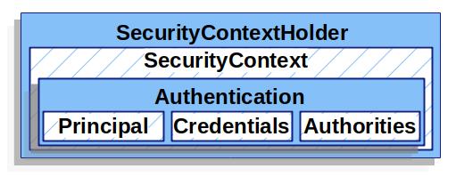

# 配置

```java
@EnableWebSecurity// 开启
public class SecurityConfig {

    // 生成验证安全的链式过滤器
    @Bean
    public SecurityFilterChain chain(HttpSecurity http) throws Exception {
        http
                .authorizeRequests()
                .antMatchers("/login").permitAll()
                .anyRequest()
                .authenticated()
                .and()
                .formLogin();
        return http.build();
    }
}
```


# 登录验证

核心对象



SecurityContextHolder存储已登录的用户信息。security不关心它如何被填充，只要存在值，它就会被当做当前已登录用户。

通过SecurityContextHolder能够获取当前登录用户。


## 密码存储

BCryptPasswordEncoder

生成：

```java
// 加密强度 调整大小使得系统验证时间在1s左右。
public static final int BCRYPT_LEN = 10;

BCryptPasswordEncoder encoder = new BCryptPasswordEncoder(BCRYPT_LEN);
// 存储格式为：加密方式+加密串
String encryptedPassword = "{bcrypt}" + encoder.encode(password);
```


## 用户对象

用户（Authentication）被定义为UserDetails。

UserDetails由UserDetailsService返回。

自定义用户对象实现UserDetails和UserDetailsService即可。


# 授权

在security中没有实质上区分角色和权限，权限在实现上等同于角色，即只有用户-角色/权限。

核心对象：GrantedAuthority

GrantedAuthority用于返回一个确定的权限，它只定义了一个方法：getAuthority()。

GrantedAuthority在UserDetails中以列表存储：

```java
@Override
public Collection<? extends GrantedAuthority> getAuthorities() {
    var authorities = new ArrayList<SimpleGrantedAuthority>();
    for (String permission : permissions) {
        authorities.add(new SimpleGrantedAuthority(permission));
    }
    return authorities;
}
```


## 方法级别授权（注解）

配置：

```java
@EnableMethodSecurity
```

注解：@PreAuthorize、@PostAuthorize

例：

```java
@PreAuthorize(hasAuthority('xxx'))
```

hasRole和hasAuthority本质上没有区别，hasRole会在权限前加上前缀”ROLE_“然后进行判断。

```java
@PreAuthorize(hasAuthority('xxx'))
// =
@PreAuthorize(hasRole('ROLE_xxx'))
```

